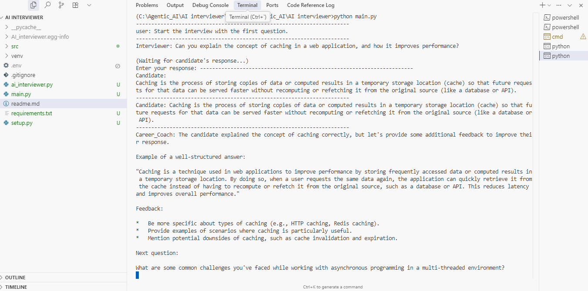

#AI Interviewer with Multi-Agent System

This project is an AI-powered interview simulation tool built using Autogen AgentChat framework and Ollama models. It creates an interactive multi-agent setup where an interviewer, candidate, and career coach collaborate in a structured mock interview environment.


## Features

Three AI Agents:

Interviewer – Conducts an interview for a given job role.

Candidate – Simulates a job applicant (user-proxy for real candidate input).

Career Coach – Provides real-time feedback and post-interview advice.

1. Round-Robin Group Chat – Agents take turns interacting with each other and the user.
2. Dynamic Questions – Interviewer tailors questions based on responses.
3. Custom Job Role Support – Easily change the job role (default: Software Engineer).
4. Termination Condition – Interview ends automatically after the final question.


## Tech Stack
Tech Stack

Python 3.9+

Autogen AgentChat

Ollama – For local LLM inference

dotenv – For environment variable management
## Installation

1. Clone the repository

```bash
 git clone https://github.com/your-username/ai-interviewer.git
cd ai-interviewer
```

2. Create and activate a virtual environment

```bash
python -m venv venv
venv\Scripts\activate      
```

3. Install dependencies

```bash
pip install -r requirements.txt
```


## Configuration
Create a .env file in the project root:
```bash
LANGCHAIN_API_KEY=your_langchain_api_key

```
## Deployment

To deploy this project in streamlit

```bash
pip install -r requirements.txt
python main.py
```


## Project Structure
AI_interviewer/
│
├── ai_interviewer.py    # Main script
├── .env                 # Environment variables (API keys, configs)
├── requirements.txt     # Dependencies
└── README.md            # Project documentation
## Dependencies

autogen-agentchat → For multi-agent system (the core framework)

autogen-ext → Extension library (for models like HuggingFace, Ollama)

python-dotenv → To load environment variables from .env

requests → For API calls (Autogen uses it internally)
## Screenshots




## Contributing

Contributions are welcome! Please open an issue or submit a pull request.


## License

[MIT](https://choosealicense.com/licenses/mit/)


## 🚀 About Me
I'm An LLM developer With Generative AI And Agentic AI Skills...


## 🔗 Links

[](https://www.linkedin.com/in/reeshma-ram-prasad-96997a20a/)
